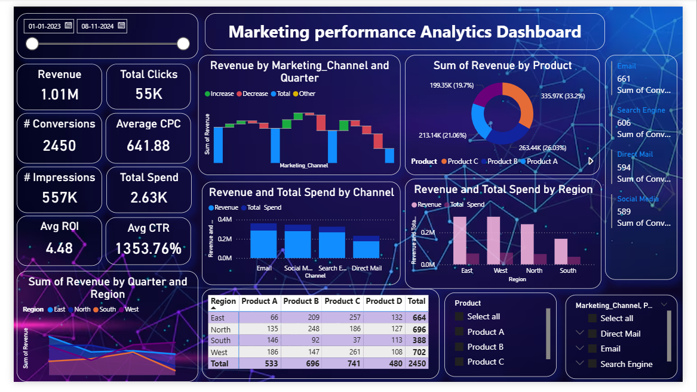

# Marketing-Funnel-and-Conversion-Performance-Analysis
# 📊 Marketing Funnel & Conversion Performance Analysis Dashboard

## 📌 Project Overview

This project focuses on analyzing the **marketing funnel and conversion performance** using an interactive Power BI dashboard. The objective is to identify conversion trends, detect drop-offs at different stages of the funnel, and evaluate the effectiveness of various marketing channels.

The dashboard provides a comprehensive view of marketing performance, including revenue, clicks, conversions, and channel-wise insights. It helps stakeholders understand how users move through the funnel and where improvements are needed to maximize conversions and ROI.

---

## 🎯 Objectives

To analyze the complete marketing funnel from impressions to conversions
To identify stages where maximum drop-offs occur
To evaluate performance of different marketing channels
To measure key metrics like revenue, CTR, CPC, and ROI
To compare performance across regions and products

---

## 📈 Key Insights

Email and Search Engine channels generate higher conversions compared to others
Some channels have high clicks but low conversions, indicating funnel drop-offs
West region contributes the highest revenue among all regions
Product-wise analysis highlights top-performing products driving revenue
Direct Mail shows relatively lower performance compared to digital channels

---

## 📊 Dashboard Features

KPI cards showing Total Revenue, Clicks, Conversions, Impressions, ROI, and CTR
Revenue analysis by marketing channel and quarter (waterfall chart)
Product-wise revenue distribution using donut chart
Channel-wise comparison of revenue and total spend
Regional performance analysis (East, West, North, South)
Interactive filters for Product, Marketing Channel, and Date Range

---

## 🛠️ Tools & Technologies Used

Power BI (Data Visualization & Dashboard Creation)
DAX (Data Analysis Expressions for KPI calculations)
Power Query (Data Transformation & Cleaning)
Microsoft Excel (Dataset & Data Source)

---

## 📁 Dataset Information

The dataset includes marketing-related attributes such as:

Marketing Channel (Email, Social Media, Search Engine, Direct Mail)
Revenue and Total Spend
Clicks, Impressions, and Conversions
Product Categories
Regional Data (East, West, North, South)
Time Period (Quarter-wise analysis)

---

## 🚀 Conclusion

This dashboard helps businesses understand the effectiveness of their marketing strategies by identifying conversion bottlenecks and high-performing channels. By leveraging these insights, organizations can optimize their campaigns, improve conversion rates, and maximize return on investment (ROI).

---

## 📸 Dashboard Preview

*(Add your screenshot here and name it `dashboard.png`)*

